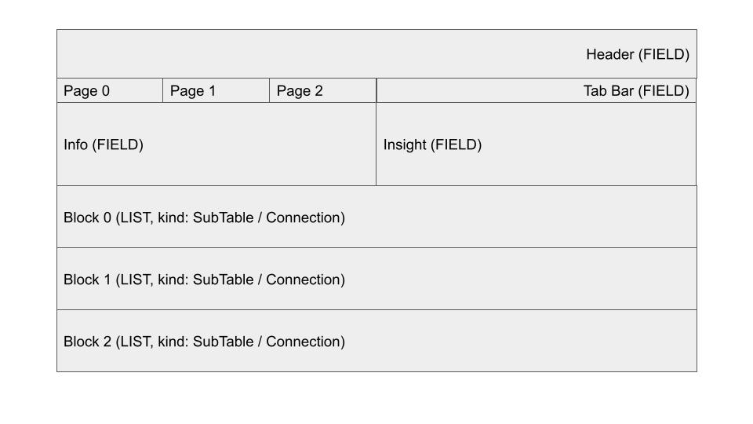

# artifacts

## Resource Layout



```bash
$ k get resourcelayout kubedb-kubedb.com-v1alpha2-mongodbs -o yaml > artifacts/kubedb-kubedb.com-v1alpha2-mongodbs.yaml

$ k create -f artifacts/render-default-layout.yaml -o yaml > artifacts/render-default-layout-response.yaml
```

```bash
$ k get genericresources mg-sh~MongoDB.kubedb.com -n demo -o yaml

$ k get genericresourceservices mg-sh~MongoDB.kubedb.com -n demo -o yaml
```

## Menu

```bash
$ k get usermenus cluster

$ k get --raw=/apis/meta.k8s.appscode.com/v1alpha1/usermenus/cluster
$ k get --raw=/apis/meta.k8s.appscode.com/v1alpha1/usermenus/cluster/available
```
